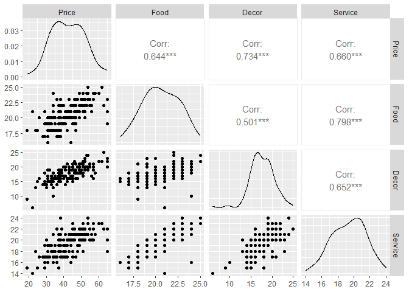

Model Selection
================

## Automatic Model Selection

When we have limited number of variables in the data set, it’s
relatively easy to construct a model and compare the performance between
them. There also exist some techniques to deal with large amount of
variables and determine which to include in the model.

This tutorial introduces three ways of automatic model selection, which
are useful when you want to decide what variables to include in your
model. We will talk about backward, forward, and stepwise selection in
`stats` package and demonstrate the R code respectively.

``` r
library(tidyverse)
library(here)
library(GGally)
library(leaps)
```

### Regression model

We will use a NYC restaurant dataset in Sheather (2009) that has
information about 150 Italian restaurants in Manhattan that were open in
2001 (some of them are closed now). The variables are:

-   Case: case-indexing variable

-   Restaurant: name of the restaurant

-   Price: average price of meal and a drink

-   Food: average Zagat rating of the quality of the food (from 0 to 25)

-   Decor: same as above, but with quality of the decor

-   Service: same as above, but with quality of service

-   East: it is equal to East if the restaurant is on the East Side
    (i.e. east of Fifth Ave) and West otherwise

First, let’s load the data:

``` r
nyc <- read_csv('https://raw.githubusercontent.com/YuxiaoLuo/r_analysis_dri_2022/main/data/nyc.csv')
```

    ## Rows: 150 Columns: 7
    ## -- Column specification --------------------------------------------------------
    ## Delimiter: ","
    ## chr (2): Restaurant, East
    ## dbl (5): Case, Price, Food, Decor, Service
    ## 
    ## i Use `spec()` to retrieve the full column specification for this data.
    ## i Specify the column types or set `show_col_types = FALSE` to quiet this message.

Let’s explore the data by looking at the variables’ type and samples.

``` r
glimpse(nyc)
```

    ## Rows: 150
    ## Columns: 7
    ## $ Case       <dbl> 148, 2, 144, 131, 26, 29, 160, 83, 105, 126, 140, 80, 7, 5,~
    ## $ Restaurant <chr> "Vago Ristorante", "Tello's Ristorante", "Giovanni", "Torre~
    ## $ Price      <dbl> 45, 32, 45, 47, 37, 49, 31, 38, 51, 47, 42, 48, 34, 54, 53,~
    ## $ Food       <dbl> 22, 20, 22, 19, 19, 22, 20, 23, 24, 18, 18, 21, 22, 24, 22,~
    ## $ Decor      <dbl> 21, 19, 19, 21, 17, 19, 17, 19, 21, 18, 21, 18, 16, 19, 24,~
    ## $ Service    <dbl> 23, 19, 21, 17, 19, 20, 19, 24, 21, 17, 17, 19, 21, 21, 21,~
    ## $ East       <chr> "West", "West", "West", "West", "East", "East", "West", "Ea~

We can also explore the summary and scatter plot matrices of hte
variables.

``` r
summary(nyc)
```

    ##       Case         Restaurant            Price            Food      
    ##  Min.   :  2.00   Length:150         Min.   :19.00   Min.   :16.00  
    ##  1st Qu.: 41.50   Class :character   1st Qu.:35.25   1st Qu.:19.00  
    ##  Median : 83.50   Mode  :character   Median :42.00   Median :21.00  
    ##  Mean   : 84.17                      Mean   :42.62   Mean   :20.61  
    ##  3rd Qu.:124.75                      3rd Qu.:49.75   3rd Qu.:22.00  
    ##  Max.   :168.00                      Max.   :65.00   Max.   :25.00  
    ##      Decor          Service          East          
    ##  Min.   : 6.00   Min.   :14.00   Length:150        
    ##  1st Qu.:16.00   1st Qu.:18.00   Class :character  
    ##  Median :18.00   Median :20.00   Mode  :character  
    ##  Mean   :17.69   Mean   :19.39                     
    ##  3rd Qu.:19.00   3rd Qu.:21.00                     
    ##  Max.   :25.00   Max.   :24.00

Note that scatterplot matrices can only show numerical variables
(continuous & discrete). So we remove **Case**, **Restaurant**, and
**East**.

``` r
nycplot <- nyc %>% select(-Case, -Restaurant, -East)
ggpairs(nycplot)
```

<!-- --> Now,
let’s construct a regression model to predict **Price** using all the
other variables as predictors.

``` r
lm_nyc <- lm(Price ~ Food + Decor + Service + East, data = nyc)
summary(lm_nyc)
```

    ## 
    ## Call:
    ## lm(formula = Price ~ Food + Decor + Service + East, data = nyc)
    ## 
    ## Residuals:
    ##      Min       1Q   Median       3Q      Max 
    ## -13.7995  -3.8323   0.0997   3.3449  16.8484 
    ## 
    ## Coefficients:
    ##               Estimate Std. Error t value Pr(>|t|)    
    ## (Intercept) -23.644163   5.079278  -4.655 7.25e-06 ***
    ## Food          1.634869   0.384961   4.247 3.86e-05 ***
    ## Decor         1.865549   0.221396   8.426 3.22e-14 ***
    ## Service       0.007626   0.432210   0.018    0.986    
    ## EastWest     -1.613350   1.000385  -1.613    0.109    
    ## ---
    ## Signif. codes:  0 '***' 0.001 '**' 0.01 '*' 0.05 '.' 0.1 ' ' 1
    ## 
    ## Residual standard error: 5.692 on 145 degrees of freedom
    ## Multiple R-squared:  0.6466, Adjusted R-squared:  0.6369 
    ## F-statistic: 66.34 on 4 and 145 DF,  p-value: < 2.2e-16

### Backward selection

Backward selection uses the `step` function in `stats` package and
select a formula-based model by [AIC (Akaike Information
Criterion)](https://en.wikipedia.org/wiki/Akaike_information_criterion).
The rule of thumb is the less the AIC score, the better the model
performs.

Let’s try backward selection, which starts with the full model and
removes the variable step by step while examining the change of AIC
score as the performance measure.

``` r
step(lm_nyc, direction = 'backward')
```

    ## Start:  AIC=526.64
    ## Price ~ Food + Decor + Service + East
    ## 
    ##           Df Sum of Sq    RSS    AIC
    ## - Service  1      0.01 4698.0 524.64
    ## <none>                 4698.0 526.64
    ## - East     1     84.27 4782.2 527.30
    ## - Food     1    584.35 5282.3 542.22
    ## - Decor    1   2300.45 6998.4 584.42
    ## 
    ## Step:  AIC=524.64
    ## Price ~ Food + Decor + East
    ## 
    ##         Df Sum of Sq    RSS    AIC
    ## <none>               4698.0 524.64
    ## - East   1     87.24 4785.2 525.40
    ## - Food   1   1166.83 5864.8 555.91
    ## - Decor  1   3062.26 7760.2 597.92

    ## 
    ## Call:
    ## lm(formula = Price ~ Food + Decor + East, data = nyc)
    ## 
    ## Coefficients:
    ## (Intercept)         Food        Decor     EastWest  
    ##     -23.628        1.640        1.867       -1.616

From the summary result, the model that uses **Food**, **Decor**, and
**East** as the independent variables to predict the **Price** is more
preferred.

### Forward selection

We can also do forward selection, which needs a starting model and a
larger model that includes all the variables that we might want to
include in our model.

``` r
# create a null model
nullnyc <- lm(Price ~ 1, data = nyc) # no variables
fwd <- step(nullnyc, 
            scope = list(upper = lm_nyc),
            direction = 'forward')
```

    ## Start:  AIC=674.68
    ## Price ~ 1
    ## 
    ##           Df Sum of Sq     RSS    AIC
    ## + Decor    1    7157.2  6138.1 560.75
    ## + Service  1    5794.1  7501.3 590.83
    ## + Food     1    5505.8  7789.5 596.48
    ## + East     1     380.3 12915.0 672.33
    ## <none>                 13295.3 674.68
    ## 
    ## Step:  AIC=560.75
    ## Price ~ Decor
    ## 
    ##           Df Sum of Sq    RSS    AIC
    ## + Food     1   1352.93 4785.2 525.40
    ## + Service  1    763.57 5374.6 542.82
    ## + East     1    273.34 5864.8 555.91
    ## <none>                 6138.1 560.75
    ## 
    ## Step:  AIC=525.4
    ## Price ~ Decor + Food
    ## 
    ##           Df Sum of Sq    RSS    AIC
    ## + East     1    87.239 4698.0 524.64
    ## <none>                 4785.2 525.40
    ## + Service  1     2.980 4782.2 527.30
    ## 
    ## Step:  AIC=524.64
    ## Price ~ Decor + Food + East
    ## 
    ##           Df Sum of Sq  RSS    AIC
    ## <none>                 4698 524.64
    ## + Service  1  0.010086 4698 526.64

From the result, you can see the best model is
`Price ~ Decor + Food + East`, which has an AIC score of 524.64.

### Stepwise regression

We can also do stepwise regression with `direction = 'both'`.In stepwise
regression, variables can get in or out of the model. We can specify the
smallest and biggest model in our search with `scope` argument in the
`step` function.

For instance, let’s start the stepwise search with a model that has
**Service** as a predictor and restrict our search to models that
include **Service** and all the other possible independent variables:

``` r
lm2_nyc <- lm(Price ~ Service, data = nyc)
step(lm2_nyc,
     scope= list(lower = lm2_nyc, upper = lm_nyc),
     direction = 'both')
```

    ## Start:  AIC=590.83
    ## Price ~ Service
    ## 
    ##         Df Sum of Sq    RSS    AIC
    ## + Decor  1   2126.70 5374.6 542.82
    ## + Food   1    498.33 7002.9 582.52
    ## <none>               7501.3 590.83
    ## + East   1      7.05 7494.2 592.69
    ## 
    ## Step:  AIC=542.82
    ## Price ~ Service + Decor
    ## 
    ##         Df Sum of Sq    RSS    AIC
    ## + Food   1    592.34 4782.2 527.30
    ## + East   1     92.26 5282.3 542.22
    ## <none>               5374.6 542.82
    ## - Decor  1   2126.70 7501.3 590.83
    ## 
    ## Step:  AIC=527.3
    ## Price ~ Service + Decor + Food
    ## 
    ##         Df Sum of Sq    RSS    AIC
    ## + East   1     84.27 4698.0 526.64
    ## <none>               4782.2 527.30
    ## - Food   1    592.34 5374.6 542.82
    ## - Decor  1   2220.71 7002.9 582.52
    ## 
    ## Step:  AIC=526.64
    ## Price ~ Service + Decor + Food + East
    ## 
    ##         Df Sum of Sq    RSS    AIC
    ## <none>               4698.0 526.64
    ## - East   1     84.27 4782.2 527.30
    ## - Food   1    584.35 5282.3 542.22
    ## - Decor  1   2300.45 6998.4 584.42

    ## 
    ## Call:
    ## lm(formula = Price ~ Service + Decor + Food + East, data = nyc)
    ## 
    ## Coefficients:
    ## (Intercept)      Service        Decor         Food     EastWest  
    ##  -23.644163     0.007626     1.865549     1.634869    -1.613350

### BIC criterion

Let’s change selection criterion to BIC using the command `k = log(n)`,
where n is the number of observations in the dataset. According to the
documentation, `k` means the multiple of the number of degrees of
freedom used for the penalty. Only k = 2 gives the genuine AIC:
`k = log(n)` is sometimes referred to as BIC or SBC.

``` r
n <-  nrow(nyc)
step(lm_nyc, direction = 'backward', k = log(n))
```

    ## Start:  AIC=541.69
    ## Price ~ Food + Decor + Service + East
    ## 
    ##           Df Sum of Sq    RSS    AIC
    ## - Service  1      0.01 4698.0 536.68
    ## - East     1     84.27 4782.2 539.35
    ## <none>                 4698.0 541.69
    ## - Food     1    584.35 5282.3 554.27
    ## - Decor    1   2300.45 6998.4 596.46
    ## 
    ## Step:  AIC=536.68
    ## Price ~ Food + Decor + East
    ## 
    ##         Df Sum of Sq    RSS    AIC
    ## - East   1     87.24 4785.2 534.43
    ## <none>               4698.0 536.68
    ## - Food   1   1166.83 5864.8 564.95
    ## - Decor  1   3062.26 7760.2 606.95
    ## 
    ## Step:  AIC=534.43
    ## Price ~ Food + Decor
    ## 
    ##         Df Sum of Sq    RSS    AIC
    ## <none>               4785.2 534.43
    ## - Food   1    1352.9 6138.1 566.77
    ## - Decor  1    3004.3 7789.5 602.51

    ## 
    ## Call:
    ## lm(formula = Price ~ Food + Decor, data = nyc)
    ## 
    ## Coefficients:
    ## (Intercept)         Food        Decor  
    ##     -25.678        1.730        1.845

### All subsets selection using `leaps`

If you want to find the ‘best’ model among a set of variables based on
BIC or adjusted R^2, you can use library `leaps`.

``` r
#library(leaps)
allsubs <- regsubsets(Price ~ Food + Decor + Service + East, data = nyc)
summary(allsubs)
```

    ## Subset selection object
    ## Call: regsubsets.formula(Price ~ Food + Decor + Service + East, data = nyc)
    ## 4 Variables  (and intercept)
    ##          Forced in Forced out
    ## Food         FALSE      FALSE
    ## Decor        FALSE      FALSE
    ## Service      FALSE      FALSE
    ## EastWest     FALSE      FALSE
    ## 1 subsets of each size up to 4
    ## Selection Algorithm: exhaustive
    ##          Food Decor Service EastWest
    ## 1  ( 1 ) " "  "*"   " "     " "     
    ## 2  ( 1 ) "*"  "*"   " "     " "     
    ## 3  ( 1 ) "*"  "*"   " "     "*"     
    ## 4  ( 1 ) "*"  "*"   "*"     "*"

From the table, we know that if the model only contains one predictor,
the one with `Decor` will has the smallest R-squared (residual sum of
squares). If the model only contains two predictors, the one with `Food`
and `Decor` will has the smallest R-squared. If the model only contains
three predictors, the one with `Food`, `Decor`, and `East` will has the
smallest R-squared. In each group of models that have a fixed number of
predictors, the best model is selected based on AIC, BIC, and adjusted
R-squared, which will coincide with the sample goal, that is, smallest
residual sum of squares [$\\hat{\\sigma^2}$]().
([AIC](https://www.statisticshowto.com/akaikes-information-criterion/),
[Adjusted
*R*<sup>2</sup>](https://www.statisticshowto.com/probability-and-statistics/statistics-definitions/adjusted-r2/))

The overall “best” model is the one selected from the 4 “best” model for
a fixed number of independent variables.
