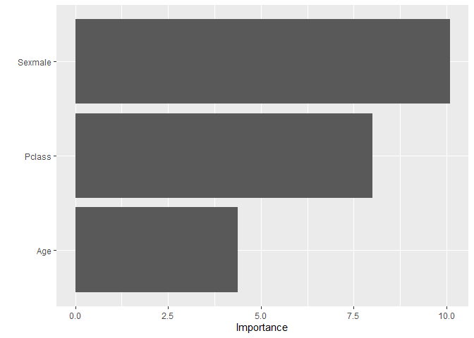

Intro to Regression Analysis
================

## Welcome

In this workshop, We will explore the basic regression analysis in R.
The datasets consist of the `spotify_lyrics` data modified from [the
kaggle
dataset](https://www.kaggle.com/zaheenhamidani/ultimate-spotify-tracks-db)
and the `spotify` data comprised of the musical attributes of weekly
[Billboard Hot 100](https://www.billboard.com/charts/billboard-200/)
songs from February 2019 to February 2021. Both of the datasets were
mined using the [spotifyr](https://www.rcharlie.com/spotifyr/) interface
to the [Spotify Web
API](https://developer.spotify.com/documentation/web-api/)\*. We will
have to load the following packages in this workshop:
`tidyverse`,`GGally`,`leaps`.

Learning objectives:

-   Exploratory data analysis

-   Fit regression models with the `lm` function

-   Fit regression models with the `glm` function

In the future:

-   Automatic model selection (package `leaps`)

-   Prediction

-   Interaction terms

Along the way, you will master the core functions for running linear
regression in R and be able to interpret the regression result generated
in R:

-   `pairs()` and `ggpairs()`, which let you explore the relationships
    among variables

-   `glimpse` and `summary()`, which let you understand the structure of
    the dataset and descriptive statistics of the variables

-   `%>%`, which organizes your code into reader-friendly “pipes”

-   `step`, which helps with automatic model selection

First, let’s load the `tidyverse` suite of packages and the `here`
package. The `here` package simplifies the way of reproducing file
paths.

``` r
library(tidyverse)
library(here)
library(GGally)
library(leaps)
```

### Spotify data

We’ll first analyze a Spotify dataset and the variables are:

-   energy: Energy is a measure from 0.0 to 1.0 and represents a
    perceptual measure of intensity and activity. Typically, energetic
    tracks feel fast, loud, and noisy

-   loudness: The overall loudness of a track in decibels (dB). Loudness
    values are averaged across the entire track and are useful for
    comparing relative loudness of tracks

-   tempo: The overall estimated tempo of a track in beats per minute
    (BPM)

-   danceability: Danceability describes how suitable a track is for
    dancing based on a combination of musical elements including tempo,
    rhythm stability, beat strength, and overall regularity

-   lyrics: lyrics in the song

More details about the variables can be found at
[here](https://github.com/YuxiaoLuo/r_analysis_dri_2022/blob/main/data/meta_spotify.md).
In our case, the dependent/response variable will be **energy**.

Let’s read the dataset first. You can load it either online or locally.

``` r
# if you haven't downloaded the dataset, load it online
spo <- read_csv("https://raw.githubusercontent.com/YuxiaoLuo/r_analysis_dri_2022/main/data/spotify_lyrics.csv")

# if you have the dataset locally, load it in the data folder
spo <- read_csv(here("data", "spotify_lyrics.csv"))

glimpse(spo)
```

    ## Rows: 26,000
    ## Columns: 6
    ## $ genre        <chr> "Alternative", "Alternative", "Alternative", "Alternative~
    ## $ energy       <dbl> 0.647, 0.735, 0.917, 0.606, 0.641, 0.973, 0.919, 0.889, 0~
    ## $ loudness     <dbl> -8.509, -4.749, -6.086, -5.060, -5.104, -3.642, -5.938, -~
    ## $ tempo        <dbl> 79.810, 163.132, 140.639, 93.060, 142.043, 125.691, 108.0~
    ## $ danceability <dbl> 0.709, 0.436, 0.544, 0.603, 0.487, 0.524, 0.657, 0.611, 0~
    ## $ lyrics       <chr> "into into into of him by economic without by his is with~

### Exploratory data analysis

The function `pairs` creates a scatterplot matrix for **numeric**
variables:

``` r
spo_plot <- spo %>% select(-genre, -lyrics)
pairs(spo_plot)
```

<!-- -->

The dataset **spo\_plot** excludes the variables **genre** and
**lyrics**. We can get quick and dirty summaries of the variables with
summary. An advantage is that it’s able to handle categorical variables,
such as **genre**:

``` r
summary(spo)
```

    ##     genre               energy            loudness           tempo       
    ##  Length:26000       Min.   :0.000216   Min.   :-47.599   Min.   : 31.03  
    ##  Class :character   1st Qu.:0.379000   1st Qu.:-11.778   1st Qu.: 93.17  
    ##  Mode  :character   Median :0.601000   Median : -7.790   Median :116.02  
    ##                     Mean   :0.568407   Mean   : -9.554   Mean   :117.95  
    ##                     3rd Qu.:0.786000   3rd Qu.: -5.508   3rd Qu.:139.34  
    ##                     Max.   :0.999000   Max.   :  3.744   Max.   :220.28  
    ##   danceability       lyrics         
    ##  Min.   :0.0592   Length:26000      
    ##  1st Qu.:0.4340   Class :character  
    ##  Median :0.5720   Mode  :character  
    ##  Mean   :0.5554                     
    ##  3rd Qu.:0.6940                     
    ##  Max.   :0.9810

The function `ggpairs` in `library(GGally)` produces the equivalent
plot, but with `ggplot2`:

``` r
ggpairs(spo_plot)
```

<!-- -->

### Fitting regression models with the lm function

Fitting regression models with R is easy as R was developed originally
as a statistical/mathematical computing language. For example, we can
fit a model where the response variable is **energy** and the predictors
are **tempo** and **loudness**.

``` r
lm_spo <- lm(energy ~ tempo + loudness, spo)

lm_spo
```

    ## 
    ## Call:
    ## lm(formula = energy ~ tempo + loudness, data = spo)
    ## 
    ## Coefficients:
    ## (Intercept)        tempo     loudness  
    ##   0.8630598    0.0004041    0.0358292

If we call the object `lm_spo`, it will return us coefficients. If we
want details about p-values, R-squared, and more, we can get them with
`summary()`.

``` r
summary(lm_spo)
```

    ## 
    ## Call:
    ## lm(formula = energy ~ tempo + loudness, data = spo)
    ## 
    ## Residuals:
    ##      Min       1Q   Median       3Q      Max 
    ## -0.63414 -0.10755  0.00001  0.10976  0.78925 
    ## 
    ## Coefficients:
    ##              Estimate Std. Error t value Pr(>|t|)    
    ## (Intercept) 8.631e-01  4.426e-03  195.01   <2e-16 ***
    ## tempo       4.041e-04  3.139e-05   12.87   <2e-16 ***
    ## loudness    3.583e-02  1.625e-04  220.54   <2e-16 ***
    ## ---
    ## Signif. codes:  0 '***' 0.001 '**' 0.01 '*' 0.05 '.' 0.1 ' ' 1
    ## 
    ## Residual standard error: 0.1521 on 25997 degrees of freedom
    ## Multiple R-squared:  0.6697, Adjusted R-squared:  0.6697 
    ## F-statistic: 2.636e+04 on 2 and 25997 DF,  p-value: < 2.2e-16

We can get diagnostic plots by plotting the model. That will give us 4
diagnostic plots. We can arrange them in a figure with x rows and y
columns with `par(mfrow=c(x,y))`.

``` r
par(mfrow=c(2,2))
plot(lm_spo)
```

<!-- -->

Plot 1 in the top left (Residuals vs Fitted) shows: 1. Whether linearity
holds. This is indicated by the mean residual value for every fitted
value region being close to 0. In R this is indicated by the red line
being close to the dashed line. 2. Whether homoskedasticity holds. The
spread of residuals should be approximately the same across the x-axis.
3. Whether there are outliers. This is indicated by some ‘extreme’
residuals that are far from the rest.
[Reference](https://boostedml.com/2019/03/linear-regression-plots-fitted-vs-residuals.html)

Plot 2 in the top right (Q-Q Plot), is a graphical tool to help us
assess if a set of data plausibly came from some theoretical
distribution such as a Normal or exponential. Ex., If both sets of
quantiles came from the same distribution, we should see the points
forming a line that’s roughly straight. More detail is
[here](https://data.library.virginia.edu/understanding-q-q-plots/).

Plot 4 in the bottom right (Residuals vs Leverage) allows us to identify
influential observations in a regression model. You can see the number
of observation that is close to or exceed the Cook’s distance in the
graph. More detail is
[here](https://www.statology.org/residuals-vs-leverage-plot/).

If we want them in 1 row and 4 columns:

``` r
par(mfrow=c(1,4))
plot(lm_spo)
```

<!-- -->

The `par(mfrow=c(x,y))` function can arrange figures with multiple rows
and columns of plots in `library(graphics)`. But it doesn’t work with
`ggplot2`, in which `grid.arrange` is used to do the same thing.

We can extract diagnostics from the regression model. For example, if we
are interested in Cook’s distances, which is useful for identifying
influential data points and outliers in the X values, we can extract
Cook’s distances and plot them against observation number.

A general rule of thumb is that any point with a Cook’s distance over
4/n (where n is the number of observations) is considered to be an
outlier. Please note that just because a data point is influential
doesn’t mean it should necessarily be deleted. You can find more the
interpretation of it
[here](https://www.statology.org/how-to-identify-influential-data-points-using-cooks-distance/).

``` r
cookd <- cooks.distance(lm_spo)
plot(cookd)
abline(h = 4/nrow(spo), lty = 2, col = "steelblue") # add cutoff line
```

<!-- -->

Other useful functions are `hatvalues` (for leverages), `residuals` (for
residuals), and `rstandard` (for standardized residuals).

Leverage is used to identify outliers with respect to the independent
variables and high-leverage points have the potential to cause large
changes in the parameter estimates when they are deleted. More details
about leverage click
[here](https://handwiki.org/wiki/Leverage_(statistics)).

Another important assumption check is the multicollinearity of the
independent variables. We can use `vif()` in `library(car)` to test it.

``` r
car::vif(lm_spo)
```

    ##    tempo loudness 
    ## 1.052857 1.052857

The rule of thumb is that VIFs exceeding 4 warrant further
investigation, while VIFs exceeding 10 are signs of serious
multicollinearity. More statistical details can be found
[here](https://online.stat.psu.edu/stat462/node/180/).

### Practice of fitting a regression model

#### Problem 1

Here, we have a NYC restaurant dataset for you to practice what we have
just learned. You’ll analyze a dataset in Sheather (2009) that has
information about 150 Italian restaurants in Manhattan that were open in
2001 (some of them are closed now). The variables are:

-   Case: case-indexing variable

-   Restaurant: name of the restaurant

-   Price: average price of meal and a drink

-   Food: average Zagat rating of the quality of the food (from 0 to 25)

-   Decor: same as above, but with quality of the decor

-   Service: same as above, but with quality of service

-   East: it is equal to East if the restaurant is on the East Side
    (i.e. east of Fifth Ave) and West otherwise.

In the practice problem, the response variable will be **Price** and the
predictors are **Food**, **Decor**, **Service**, **East**. You will have
to:

1.  Load the dataset in R.

2.  Using the link:
    `read_csv('https://raw.githubusercontent.com/YuxiaoLuo/r_analysis_dri_2022/main/data/nyc.csv')`

3.  Or load it locally: `read_csv(here('data', 'nyc.csv'))`

4.  Explore the relationship between variables

5.  Run a linear regression model and generate the regression result

#### Problem 2

Here we have another `cars` dataset located in the `library(caret)`,
which is the Kelly Blue Book resale data for 2005 model year GM cars.
Since this dataset is built inside the package, we can load it using
`data(cars)`. There are many other datasets in `caret` and you can check
them out [here](https://topepo.github.io/caret/data-sets.html).

``` r
library(caret)
data(cars)
glimpse(cars)
```

    ## Rows: 804
    ## Columns: 18
    ## $ Price       <dbl> 22661.05, 21725.01, 29142.71, 30731.94, 33358.77, 30315.17~
    ## $ Mileage     <int> 20105, 13457, 31655, 22479, 17590, 23635, 17381, 27558, 25~
    ## $ Cylinder    <int> 6, 6, 4, 4, 4, 4, 4, 4, 4, 4, 4, 4, 4, 4, 4, 4, 4, 4, 4, 4~
    ## $ Doors       <int> 4, 2, 2, 2, 2, 2, 2, 2, 2, 4, 4, 4, 4, 4, 4, 4, 4, 4, 4, 4~
    ## $ Cruise      <int> 1, 1, 1, 1, 1, 1, 1, 1, 1, 1, 1, 1, 1, 1, 1, 1, 1, 1, 1, 1~
    ## $ Sound       <int> 0, 1, 1, 0, 1, 0, 1, 0, 0, 0, 1, 1, 1, 0, 1, 0, 1, 1, 1, 0~
    ## $ Leather     <int> 0, 0, 1, 0, 1, 0, 1, 1, 0, 1, 0, 1, 1, 0, 1, 1, 1, 1, 1, 1~
    ## $ Buick       <int> 1, 0, 0, 0, 0, 0, 0, 0, 0, 0, 0, 0, 0, 0, 0, 0, 0, 0, 0, 0~
    ## $ Cadillac    <int> 0, 0, 0, 0, 0, 0, 0, 0, 0, 0, 0, 0, 0, 0, 0, 0, 0, 0, 0, 0~
    ## $ Chevy       <int> 0, 1, 0, 0, 0, 0, 0, 0, 0, 0, 0, 0, 0, 0, 0, 0, 0, 0, 0, 0~
    ## $ Pontiac     <int> 0, 0, 0, 0, 0, 0, 0, 0, 0, 0, 0, 0, 0, 0, 0, 0, 0, 0, 0, 0~
    ## $ Saab        <int> 0, 0, 1, 1, 1, 1, 1, 1, 1, 1, 1, 1, 1, 1, 1, 1, 1, 1, 1, 1~
    ## $ Saturn      <int> 0, 0, 0, 0, 0, 0, 0, 0, 0, 0, 0, 0, 0, 0, 0, 0, 0, 0, 0, 0~
    ## $ convertible <int> 0, 0, 1, 1, 1, 1, 1, 1, 1, 0, 0, 0, 0, 0, 0, 0, 0, 0, 0, 0~
    ## $ coupe       <int> 0, 1, 0, 0, 0, 0, 0, 0, 0, 0, 0, 0, 0, 0, 0, 0, 0, 0, 0, 0~
    ## $ hatchback   <int> 0, 0, 0, 0, 0, 0, 0, 0, 0, 0, 0, 0, 0, 0, 0, 0, 0, 0, 0, 0~
    ## $ sedan       <int> 1, 0, 0, 0, 0, 0, 0, 0, 0, 1, 1, 1, 1, 1, 1, 1, 1, 1, 1, 1~
    ## $ wagon       <int> 0, 0, 0, 0, 0, 0, 0, 0, 0, 0, 0, 0, 0, 0, 0, 0, 0, 0, 0, 0~

What you need to do:

1.  Load the dataset following the code above.

2.  Try to find out the variable description using the Help window in R.
    (Hint: `?caret::cars`)

3.  Fit a regression model to explain/predict the **Price** of the GM
    cars.

4.  Think about other regression models that makes sense to you and
    choose the one with the best performance (*R*<sup>2</sup>).

5.  Does your model perform better than the one I proposed (solution at
    the end of this page)?

### Fitting Logistic Regression with the glm function

Logistic regression is used when the response variable is a binary (ex.,
0 and 1). We will use a `titanic` dataset to demonstrate how to run a
logistic regression in R using `glm` function. The variables are:

1.  survived: Survival (0 = No; 1 = Yes)

2.  sex: Sex

3.  age: Age

4.  Pclass: Passenger Class (1 = 1st, 2 = 2nd, 3 = 3rd)

We will use **survived** as response variable, and the other 3 as
independent variables.

``` r
# if you haven't downloaded the dataset, load it online
tita <- read_csv("https://raw.githubusercontent.com/YuxiaoLuo/r_analysis_dri_2022/main/data/titanic_train.csv")

# if you have the dataset locally, load it in the data folder
tita <- read_csv(here("data","titanic_train.csv"))
```

Explore the variables in `titanic` dataset.

``` r
glimpse(tita)
```

    ## Rows: 500
    ## Columns: 4
    ## $ Survived <dbl> 0, 1, 1, 1, 0, 0, 1, 1, 1, 1, 0, 0, 1, 0, 0, 1, 1, 0, 1, 0, 0~
    ## $ Pclass   <dbl> 3, 1, 3, 1, 3, 3, 3, 2, 3, 1, 3, 3, 2, 3, 2, 2, 1, 3, 3, 2, 1~
    ## $ Age      <dbl> 22, 38, 26, 35, 35, 2, 27, 14, 4, 58, 20, 39, 55, 31, 35, 34,~
    ## $ Sex      <chr> "male", "female", "female", "female", "male", "male", "female~

Visualize the relationships among the variables.

``` r
GGally::ggpairs(tita, axisLabels = "show")
```

<!-- -->

Fit a logistic regression using `glm` function. We need to specify the
residual distribution and link function to be used in the model in the
parameter `family`. Once we specify `binomial` distribution, `logit` is
the default link function. For example, if you want to do probit
regression, you will specify `probit` in the link function as
`family = binomial(link = "probit")`.

``` r
mod <- glm(Survived ~ Pclass + Age + Sex, family = "binomial", data = tita)
summary(mod)
```

    ## 
    ## Call:
    ## glm(formula = Survived ~ Pclass + Age + Sex, family = "binomial", 
    ##     data = tita)
    ## 
    ## Deviance Residuals: 
    ##     Min       1Q   Median       3Q      Max  
    ## -2.0189  -0.6874  -0.3766   0.6134   2.5049  
    ## 
    ## Coefficients:
    ##              Estimate Std. Error z value Pr(>|z|)    
    ## (Intercept)  5.242211   0.604223   8.676  < 2e-16 ***
    ## Pclass      -1.333798   0.166575  -8.007 1.17e-15 ***
    ## Age         -0.040199   0.009178  -4.380 1.19e-05 ***
    ## Sexmale     -2.524715   0.250228 -10.090  < 2e-16 ***
    ## ---
    ## Signif. codes:  0 '***' 0.001 '**' 0.01 '*' 0.05 '.' 0.1 ' ' 1
    ## 
    ## (Dispersion parameter for binomial family taken to be 1)
    ## 
    ##     Null deviance: 678.28  on 499  degrees of freedom
    ## Residual deviance: 449.25  on 496  degrees of freedom
    ## AIC: 457.25
    ## 
    ## Number of Fisher Scoring iterations: 5

From the regression result, we see that **Pclass**, **Age**, and **Sex**
are all statistically significant. The AIC score is 457.25.

`vip` is an R package for constructing variable importance (VI)
scores/plots for many type of supervised learning algorithms using
model-specific and novel model-agnostic approaches.

``` r
library(vip)
```

    ## 
    ## Attaching package: 'vip'

    ## The following object is masked from 'package:utils':
    ## 
    ##     vi

``` r
vi(mod)
```

    ## # A tibble: 3 x 3
    ##   Variable Importance Sign 
    ##   <chr>         <dbl> <chr>
    ## 1 Sexmale       10.1  NEG  
    ## 2 Pclass         8.01 NEG  
    ## 3 Age            4.38 NEG

`vip` function can create a variable importance barplot, which is based
on `ggplot2`.

``` r
vip(mod)
```

<!-- -->

If there are many variables (here we only have 3), you can change
barplot to points and make the visualization more readable by changing
it from vertical to horizontal and add color to the points based on the
sign of the importance score.

``` r
vip(mod, num_features = length(coef(mod)), geom = "point", horizontal = FALSE, mapping = aes_string(color = "Sign"))
```

<!-- -->

This `vip` package can be used to many other machine learning algorithms
too, ex., neural network, random forest, support vector machine, etc.
This [article](https://koalaverse.github.io/vip/articles/vip.html)
introduces its usage more thoroughly. This
[paper](https://cran.r-project.org/web/packages/vip/vignettes/vip-introduction.pdf)
explains the computational mechanism in detail.

### Solutions to the Practice Problems

#### Problem 1

Load the dataset into R and take a look at the variables.

``` r
nyc <- read_csv('https://raw.githubusercontent.com/YuxiaoLuo/r_analysis_dri_2022/main/data/nyc.csv')
glimpse(nyc)
```

    ## Rows: 150
    ## Columns: 7
    ## $ Case       <dbl> 148, 2, 144, 131, 26, 29, 160, 83, 105, 126, 140, 80, 7, 5,~
    ## $ Restaurant <chr> "Vago Ristorante", "Tello's Ristorante", "Giovanni", "Torre~
    ## $ Price      <dbl> 45, 32, 45, 47, 37, 49, 31, 38, 51, 47, 42, 48, 34, 54, 53,~
    ## $ Food       <dbl> 22, 20, 22, 19, 19, 22, 20, 23, 24, 18, 18, 21, 22, 24, 22,~
    ## $ Decor      <dbl> 21, 19, 19, 21, 17, 19, 17, 19, 21, 18, 21, 18, 16, 19, 24,~
    ## $ Service    <dbl> 23, 19, 21, 17, 19, 20, 19, 24, 21, 17, 17, 19, 21, 21, 21,~
    ## $ East       <chr> "West", "West", "West", "West", "East", "East", "West", "Ea~

Further explore the data with `summary` and `ggpairs`.

``` r
summary(nyc)
```

    ##       Case         Restaurant            Price            Food      
    ##  Min.   :  2.00   Length:150         Min.   :19.00   Min.   :16.00  
    ##  1st Qu.: 41.50   Class :character   1st Qu.:35.25   1st Qu.:19.00  
    ##  Median : 83.50   Mode  :character   Median :42.00   Median :21.00  
    ##  Mean   : 84.17                      Mean   :42.62   Mean   :20.61  
    ##  3rd Qu.:124.75                      3rd Qu.:49.75   3rd Qu.:22.00  
    ##  Max.   :168.00                      Max.   :65.00   Max.   :25.00  
    ##      Decor          Service          East          
    ##  Min.   : 6.00   Min.   :14.00   Length:150        
    ##  1st Qu.:16.00   1st Qu.:18.00   Class :character  
    ##  Median :18.00   Median :20.00   Mode  :character  
    ##  Mean   :17.69   Mean   :19.39                     
    ##  3rd Qu.:19.00   3rd Qu.:21.00                     
    ##  Max.   :25.00   Max.   :24.00

Create a dataset nycplot excludes the variables Case, Restaurant, and
East.

``` r
nycplot <- nyc %>% select(-Case, -Restaurant, -East)
ggpairs(nycplot)
```

<!-- -->

Do you see any interesting patterns in the matrix? Now, let’s run the
regression based on the proposed model, where **Price** is the dependent
variable and the predictors are **Food**, **Decor**, **Service**, and
**East**.

``` r
lm_nyc <- lm(Price ~ Food + Decor + Service + East, data = nyc)
summary(lm_nyc)
```

    ## 
    ## Call:
    ## lm(formula = Price ~ Food + Decor + Service + East, data = nyc)
    ## 
    ## Residuals:
    ##      Min       1Q   Median       3Q      Max 
    ## -13.7995  -3.8323   0.0997   3.3449  16.8484 
    ## 
    ## Coefficients:
    ##               Estimate Std. Error t value Pr(>|t|)    
    ## (Intercept) -23.644163   5.079278  -4.655 7.25e-06 ***
    ## Food          1.634869   0.384961   4.247 3.86e-05 ***
    ## Decor         1.865549   0.221396   8.426 3.22e-14 ***
    ## Service       0.007626   0.432210   0.018    0.986    
    ## EastWest     -1.613350   1.000385  -1.613    0.109    
    ## ---
    ## Signif. codes:  0 '***' 0.001 '**' 0.01 '*' 0.05 '.' 0.1 ' ' 1
    ## 
    ## Residual standard error: 5.692 on 145 degrees of freedom
    ## Multiple R-squared:  0.6466, Adjusted R-squared:  0.6369 
    ## F-statistic: 66.34 on 4 and 145 DF,  p-value: < 2.2e-16

Run the diagnostic graphs and VIF checks.

``` r
par(mfrow=c(2,2))
plot(lm_nyc)
```

<!-- -->

``` r
car::vif(lm_nyc)
```

    ##     Food    Decor  Service     East 
    ## 2.760715 1.781993 3.710626 1.075941

Read the regression result, what conclusions can you draw from it?

#### Problem 2

In my model, the response variable is **Price** and the independent
variables are **Mileage**, **Cylinder**, **Doors**, **Cruise**.

``` r
lm_cars <- lm(Price ~ Mileage + Cylinder + Doors + Cruise, data = cars)
summary(lm_cars)
```

    ## 
    ## Call:
    ## lm(formula = Price ~ Mileage + Cylinder + Doors + Cruise, data = cars)
    ## 
    ## Residuals:
    ##    Min     1Q Median     3Q    Max 
    ## -12618  -5811  -1774   4006  33229 
    ## 
    ## Coefficients:
    ##               Estimate Std. Error t value Pr(>|t|)    
    ## (Intercept)  7.718e+03  1.678e+03   4.600 4.92e-06 ***
    ## Mileage     -1.662e-01  3.256e-02  -5.106 4.12e-07 ***
    ## Cylinder     3.370e+03  2.056e+02  16.388  < 2e-16 ***
    ## Doors       -1.508e+03  3.139e+02  -4.804 1.86e-06 ***
    ## Cruise       5.964e+03  6.613e+02   9.018  < 2e-16 ***
    ## ---
    ## Signif. codes:  0 '***' 0.001 '**' 0.01 '*' 0.05 '.' 0.1 ' ' 1
    ## 
    ## Residual standard error: 7552 on 799 degrees of freedom
    ## Multiple R-squared:  0.4191, Adjusted R-squared:  0.4162 
    ## F-statistic: 144.1 on 4 and 799 DF,  p-value: < 2.2e-16

Compare your model with this one, which one performs better?


